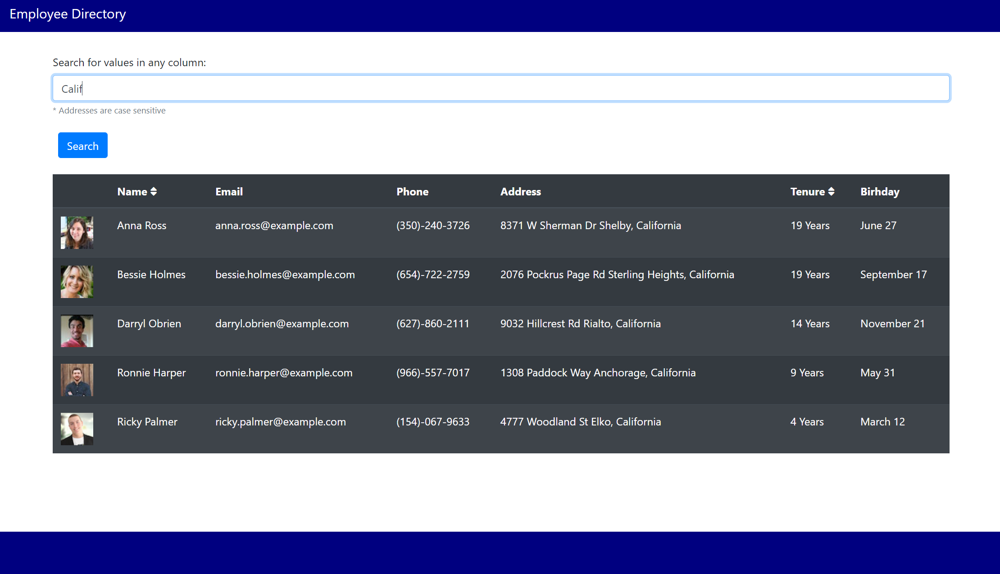

# employee-directory



## Description
Mock employee directory for seach purposes

## Features
* Search functionality
* Sort by name and tenure

## Installation
Clone the repo, install dependencies
```
npm i
```

## Dependencies
```
    "@testing-library/jest-dom": "^5.11.9",
    "@testing-library/react": "^11.2.3",
    "@testing-library/user-event": "^12.6.0",
    "axios": "^0.21.1",
    "bootstrap": "^4.5.3",
    "moment": "^2.29.1",
    "react": "^17.0.1",
    "react-dom": "^17.0.1",
    "react-hanger": "^2.2.1",
    "react-router-dom": "^5.2.0",
    "react-scripts": "4.0.1",
    "web-vitals": "^0.2.4"
```

## Areas to Improve
* Refine searches using number to only include certain columns
* Expand sorting capabilities
* Change sort icon based on direction


## Questions

   * Github: https://github.com/kshaq777
   * Email: [kshaq777@gmail.com](mailto:kshaq777@gmail.com)